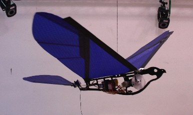

# Ornithopter

## Project proposal Pitch
I am proposing an autonomous ornithopter as a longterm project in RMI 

### Ornithopter???
An ornithopter is in simplest terms a mechanical bird that flies by flapping it's wings contrary to that of an aeroplane or a quadcopter

### What inspired an Ornithopter
I wanted to work on applying reinforcement learning on a robot and also have wanted to work on aerial robotics.
for a while i thought of working on the Drone but one day I came across this video

There are several reasons for me not choosing the drone as my project instead of working on the drone 

### How does it work

the flapping mechanism will be actuated by a single BLDC motor and there will be a gearbox for the necessary reductions

there are several other mechanisms but this is the one currently in my mind but I have'nt done the math regarding the gearbox so I don't know how good this is but this was the most commonly one I ound

### How do we actually control the ornithopter
I plan on using a Raspberry pi zero with ubuntu core and ros

it is a smaller and cheaper raspberry_pi but still has wifi capabilities and can run ros

then I will interface an atmega328p(**NOT YET FINAL** could be any ucontroller) ic with the pi_0 to output 3 pwm 
there will be a pan and tilt mechanism at the tail end to control the roll and pitch of the ornithopter 
The final bot will look a lot like this

### Good examples

[patapata ornithopter by takemura](https://www.youtube.com/watch?v=uUcmJcTL0-0)

the kestrel ornithopter

### When is a good time to use it 

when the application requires high maneuverability and efficiency

* surveilance applications like navigating inside a forest for observing wildlife

* A fixed wing aircraft can never match the maneuverability of an ornithopter

### Cons

* scaling issues 

* insect flight based models are not very efficient

